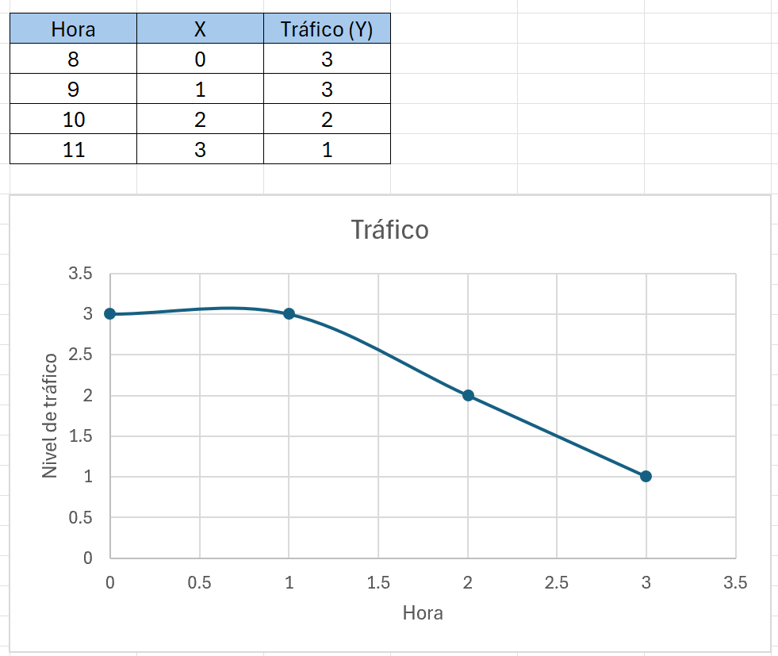

El mejor momento para salir es entre las 10 y 11 de la mañana.
A las 11 si el trayecto no es tan largo, ya que hay un tráfico bajo.
A las 10 es una buena hora si tienes un trayecto largo y necesitas llegar temprano, ya que en lo que llegas a tu destino, el tráfico ya está bajo.

